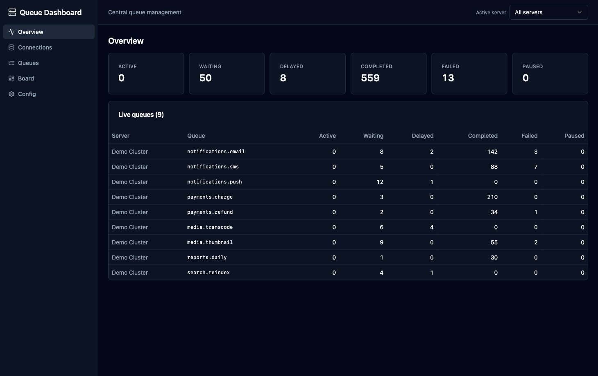
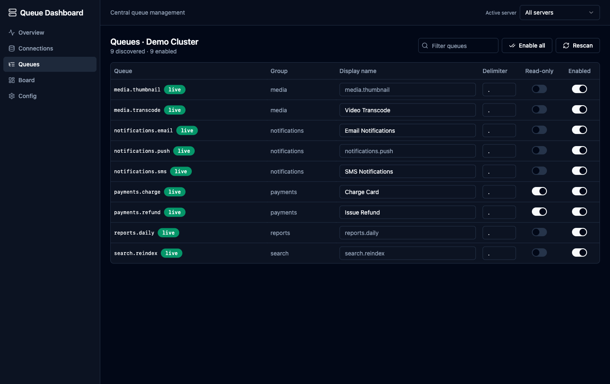
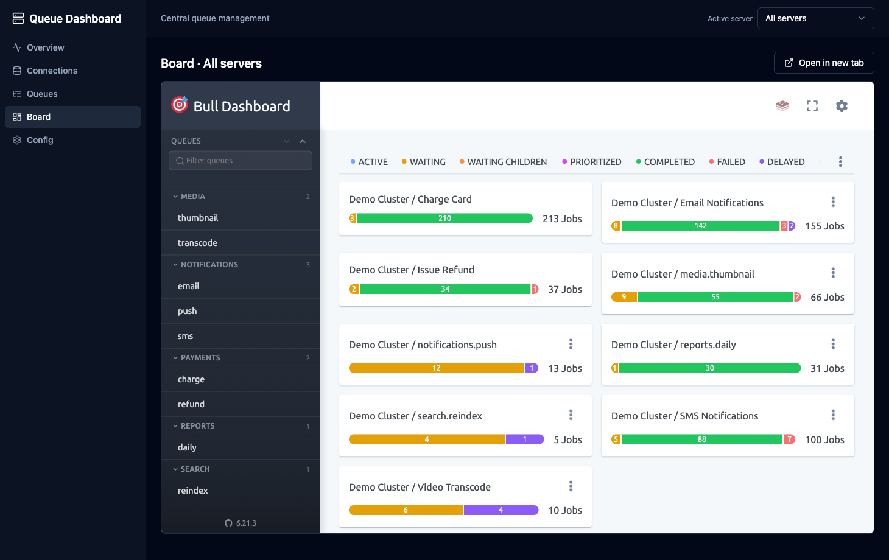
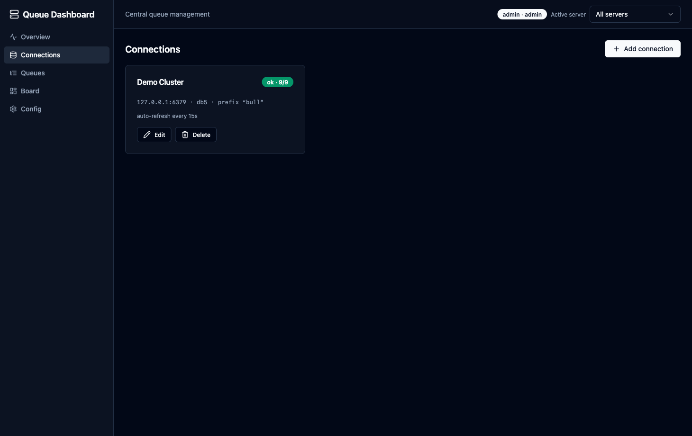
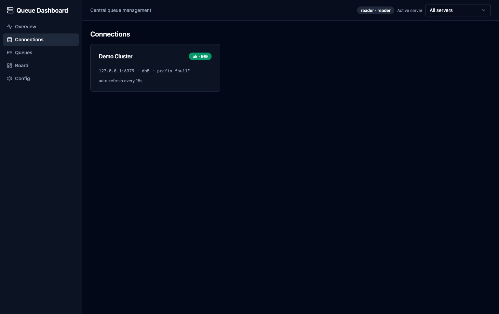

# BullMQ Control Dashboard

[](https://hub.docker.com/r/imatefx/bullmq-control-dashboard)
[](https://hub.docker.com/r/imatefx/bullmq-control-dashboard)

A central **BullMQ queue management** system built on top of
[bull-board](https://github.com/felixmosh/bull-board), with a responsive React + shadcn UI in
front of it.

Published image: [`imatefx/bullmq-control-dashboard`](https://hub.docker.com/r/imatefx/bullmq-control-dashboard)
(`linux/amd64` + `linux/arm64`).

## Screenshots

**Overview** — aggregate job counts across every live queue:



**Queues** — auto-discovered queues with grouping, rename, and read-only controls:



**Board** — the embedded bull-board for the active server (or all servers combined):



> Screenshots use a demo dataset (`npm run seed:demo`).

- **Add Redis connections** from the UI (multiple servers at once).
- **Auto-discover** all BullMQ queues in each Redis (`SCAN <prefix>:*:meta`).
- **Group, rename, and toggle read-only** per queue (bull-board `delimiter` / `displayName` /
  `readOnlyMode`).
- **Switch between servers** — each connection gets its own embedded bull-board at
  `/board/:connId`, plus a combined `/board/all`.
- **Auto-refresh** queues on an interval, or rescan on demand; queues are added/removed on the
  board live via bull-board's `addQueue` / `removeQueue`.
- **Export / import** the whole config as JSON (secrets redacted by default; passwords support
  `${ENV_VAR}` templates).
- **Overview** page aggregating job counts across all live queues.

## Architecture

Single combined Node service:

- **`server/`** — Express. Mounts a bull-board instance per connection at `/board/:connId`, a REST
  API at `/api/*`, an SSE stream at `/api/events`, and serves the built UI.
  - `discovery.ts` SCANs Redis for queue names; `queueManager.ts` instantiates a BullMQ `Queue` +
    `BullMQAdapter` per enabled queue and reconciles them into the right board on each sync.
  - `config.ts` persists everything to `config/config.json` (the source of truth).
- **`web/`** — Vite + React + TypeScript + Tailwind + shadcn/ui. Pages: Overview, Connections,
  Queues, Board, Config. A top-bar **server switcher** scopes the active server.

> bull-board renders live `Queue` objects — it has no Redis discovery, config, or auth of its own.
> This app supplies all three around it.

## Run

Requirements: Node 18+ and a reachable Redis.

> **Auth is required.** The server refuses to start without admin credentials. Copy `.env.example`
> to `.env` and set `ADMIN_USERNAME` / `ADMIN_PASSWORD` (and optionally a reader). See
> [Authentication](#authentication).

```bash
cp .env.example .env   # set ADMIN_USERNAME / ADMIN_PASSWORD (+ optional reader)
npm install

# (optional) seed a local Redis with demo queues
npm run seed         # 4 simple queues in db 0
npm run seed:demo    # richer demo set (db 5) used for the screenshots above

# dev: API on :3010, Vite UI on :5173 (proxies /api and /board to the API)
npm run dev

# production: build the UI + server, then serve everything from :3010
npm run build
npm start            # http://localhost:3010
```

Config is stored at `config/config.json` (gitignored). Override the location with `CONFIG_PATH`,
the port with `PORT`.

## Authentication

The dashboard is protected by **HTTP Basic Auth** with two env-configured roles:

| Role     | Access |
| -------- | ------ |
| `admin`  | Full — manage connections, edit/enable queues, board job actions (retry/clean/pause), import config, export with secrets. |
| `reader` | Read-only — view every page and the embedded board, but no mutations. |

Credentials come from the environment (a `.env` file works locally; see `.env.example`):

```bash
ADMIN_USERNAME=admin
ADMIN_PASSWORD=change-me
READER_USERNAME=reader      # optional — omit to disable the reader role
READER_PASSWORD=change-me-too
```

How it works:
- The server **fails closed** — it will not start unless `ADMIN_USERNAME` + `ADMIN_PASSWORD` are set.
- Enforcement is a single rule: **readers may only issue GET requests.** Every mutating REST
  endpoint and every bull-board job action is a non-GET request, so this makes the whole app
  (API + embedded board) read-only for readers (`403` on writes). The UI also hides write controls
  for readers.
- The browser prompts once and reuses the credentials for all requests, including the board
  `<iframe>` and the live SSE stream. (Basic Auth has no real "logout" — close the browser/tab.)
- **Caveat:** for readers, bull-board's own action buttons are still *visible* in the iframe but
  return `403` if clicked (we block writes server-side rather than rendering a separate read-only
  board).

The UI adapts to the role — admin sees all write controls, reader sees a read-only view:

| Admin | Reader |
| ----- | ------ |
|  |  |

## Docker

### Pull the published image

The prebuilt multi-arch image is on Docker Hub — no build required:

```bash
docker run -p 3010:3010 \
  -v "$(pwd)/config:/app/config" \
  -e ADMIN_USERNAME=admin -e ADMIN_PASSWORD=change-me \
  -e READER_USERNAME=reader -e READER_PASSWORD=change-me-too \
  imatefx/bullmq-control-dashboard:latest
```

Then open http://localhost:3010. To reach a Redis running on your host, use host
`host.docker.internal` when adding a connection.

### Build it yourself

Multi-stage `Dockerfile` builds the UI + server into a small runtime image. The config lives on a
mounted volume so it survives restarts.

```bash
# Build
docker build -t bullmq-control-dashboard .

# Run — mount a host folder for the config and pass auth credentials
docker run -p 3010:3010 \
  -v "$(pwd)/config:/app/config" \
  -e ADMIN_USERNAME=admin -e ADMIN_PASSWORD=change-me \
  -e READER_USERNAME=reader -e READER_PASSWORD=change-me-too \
  bullmq-control-dashboard
```

Or use Compose (brings up the app + a Redis, with the config volume already wired). It reads auth
credentials from a host `.env` file:

```bash
cp .env.example .env           # set ADMIN_USERNAME / ADMIN_PASSWORD
docker compose up --build      # http://localhost:3010
```

Connecting to Redis from inside the container:
- **Compose**: add a connection with host `redis` (the service name).
- **Standalone app container → Redis on your host**: use host `host.docker.internal`.

Overridable env vars: `PORT`, `CONFIG_PATH` (default `/app/config/config.json`), `WEB_DIST`.

## Notes

- **Auth**: HTTP Basic Auth with `admin` / `reader` roles — see [Authentication](#authentication).
- **Combined board** keys queues by name, so identical queue names across servers are deduped
  (first one wins). Per-server boards have no such limitation.
